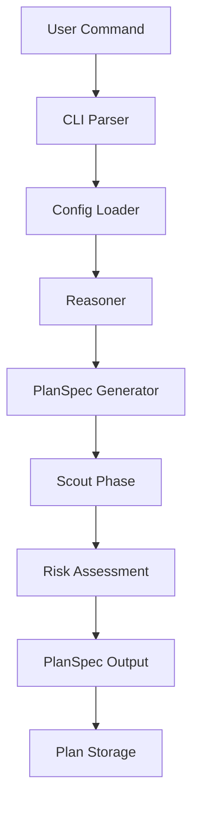
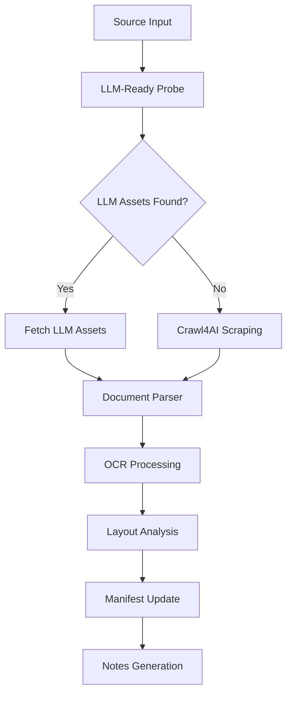
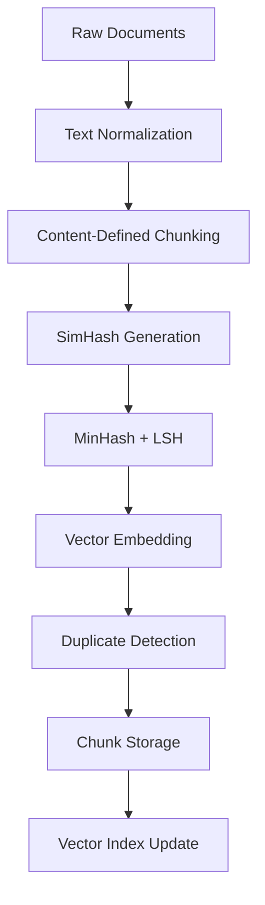
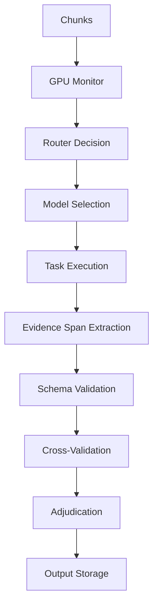
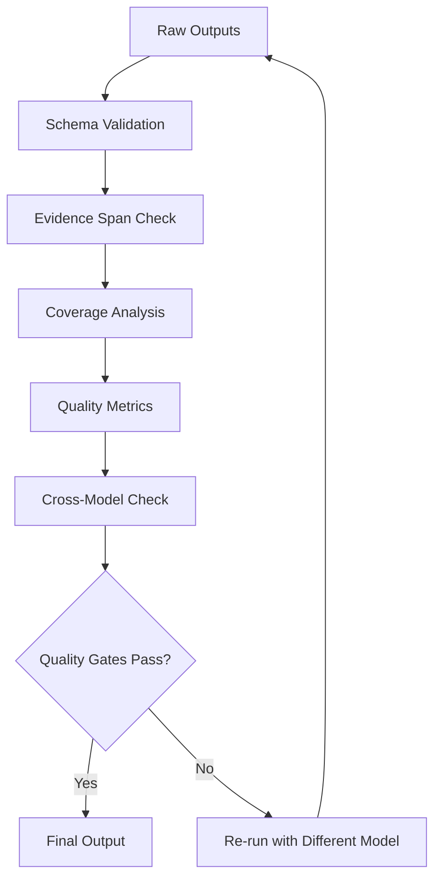

# Gola Architecture Documentation

## System Overview

Gola is designed as a modular, event-driven system with AI-powered orchestration. The architecture follows a pipeline pattern with clear separation of concerns and robust error handling.

## High-Level Architecture

```
┌─────────────────┐    ┌─────────────────┐    ┌─────────────────┐
│   Data Sources  │    │  Ingestion      │    │   Processing    │
│                 │    │  Pipeline       │    │   Pipeline      │
│ • Files/Folders │───▶│                 │───▶│                 │
│ • Web URLs      │    │ • LLM-Ready     │    │ • Chunking      │
│ • APIs          │    │   Probe         │    │ • Deduplication │
│ • Databases     │    │ • Crawl4AI      │    │ • Normalization │
└─────────────────┘    │ • Document      │    │ • Vector        │
                       │   Parsing       │    │   Processing    │
                       └─────────────────┘    └─────────────────┘
                                │                       │
                                ▼                       ▼
                       ┌─────────────────┐    ┌─────────────────┐
                       │   Reasoner      │    │   Builders      │
                       │   (Orchestrator)│    │                 │
                       │                 │    │ • Summary       │
                       │ • PlanSpec      │    │ • Entities      │
                       │ • GPU Monitor   │    │ • Triples       │
                       │ • Router        │    │ • QA Pairs      │
                       │ • Validator     │    │ • Domain Tasks  │
                       └─────────────────┘    └─────────────────┘
                                │                       │
                                ▼                       ▼
                       ┌─────────────────┐    ┌─────────────────┐
                       │   Validation    │    │   Export &      │
                       │   Pipeline      │    │   Indexing      │
                       │                 │    │                 │
                       │ • Schema Check  │    │ • JSONL/CSV     │
                       │ • Cross-Validate│    │ • Parquet       │
                       │ • Quality Gates │    │ • Qdrant Index  │
                       │ • Adjudication  │    │ • Provenance    │
                       └─────────────────┘    └─────────────────┘
```

## Component Architecture

### 1. CLI Interface (`cli/`)

**Purpose**: Main entry point for user interactions

**Structure**:
```
cli/
├── __init__.py
├── main.py              # Main CLI entry point
├── commands/
│   ├── __init__.py
│   ├── plan.py          # Planning commands
│   ├── ingest.py        # Ingestion commands
│   ├── build.py         # Dataset building
│   ├── validate.py      # Validation commands
│   ├── export.py        # Export commands
│   ├── crawl.py         # Web crawling
│   └── mcp.py           # MCP server
└── utils/
    ├── __init__.py
    ├── config.py        # Configuration loading
    └── logging.py       # Logging setup
```

**Key Features**:
- Typer-based CLI with rich output
- Command grouping and help system
- Configuration management
- Progress tracking and status updates

### 2. MCP Server (`mcp/`)

**Purpose**: Expose Gola capabilities to other agents via Model Context Protocol

**Structure**:
```
mcp/
├── __init__.py
├── server.py            # Main MCP server
├── tools/
│   ├── __init__.py
│   ├── plan.py          # Planning tools
│   ├── ingest.py        # Ingestion tools
│   ├── build.py         # Building tools
│   ├── validate.py      # Validation tools
│   ├── export.py        # Export tools
│   ├── crawl.py         # Crawling tools
│   └── probe.py         # LLM-ready probing
├── resources/
│   ├── __init__.py
│   ├── datasets.py      # Dataset resources
│   ├── notes.py         # Document notes
│   └── plans.py         # PlanSpec resources
└── schemas/
    ├── __init__.py
    └── mcp_types.py     # MCP-specific types
```

**Exposed Tools**:
- `plan(source, mode, budget)` → PlanSpec
- `ingest(path|config)` → File/Crawl IDs
- `build(tasks, mode, policy)` → Run IDs
- `validate(dataset)` → Quality Report
- `export(dataset, format)` → File Paths
- `probe.llm_ready(site)` → LLM Assets

### 3. Reasoner (`reasoner/`)

**Purpose**: AI-driven orchestration and planning

**Structure**:
```
reasoner/
├── __init__.py
├── core.py              # Main reasoner logic
├── planner.py           # PlanSpec generation
├── monitor.py           # GPU and system monitoring
├── router.py            # Model routing logic
├── validator.py         # Quality validation
├── adjudicator.py       # Conflict resolution
└── schemas/
    ├── __init__.py
    ├── plan_spec.py     # PlanSpec schema
    ├── metrics.py       # Performance metrics
    └── quality.py       # Quality gates
```

**Key Responsibilities**:
- Generate and update PlanSpec
- Monitor GPU utilization and system resources
- Route tasks to appropriate models
- Validate outputs and enforce quality gates
- Resolve conflicts between models

### 4. Pipeline (`pipeline/`)

**Purpose**: Core data processing components

**Structure**:
```
pipeline/
├── __init__.py
├── ingest/
│   ├── __init__.py
│   ├── watcher.py       # File system monitoring
│   ├── parser.py        # Document parsing
│   ├── ocr.py          # OCR processing
│   ├── web/
│   │   ├── __init__.py
│   │   ├── probe.py     # LLM-ready detection
│   │   ├── crawler.py   # Crawl4AI integration
│   │   └── sitemap.py   # Sitemap processing
│   └── manifest.py      # File manifest management
├── normalize/
│   ├── __init__.py
│   ├── text.py          # Text normalization
│   ├── layout.py        # Layout analysis
│   └── encoding.py      # Encoding fixes
├── chunk/
│   ├── __init__.py
│   ├── fastcdc.py       # Content-defined chunking
│   ├── paragraph.py     # Paragraph detection
│   └── boundaries.py    # Stable boundaries
├── dedup/
│   ├── __init__.py
│   ├── simhash.py       # SimHash implementation
│   ├── minhash.py       # MinHash + LSH
│   ├── vector.py        # Vector similarity
│   └── qdrant_client.py # Qdrant integration
├── builders/
│   ├── __init__.py
│   ├── base.py          # Base builder class
│   ├── summary.py       # Summary extraction
│   ├── entities.py      # Entity recognition
│   ├── triples.py       # Triple extraction
│   ├── qa.py           # QA pair generation
│   ├── topics.py        # Topic classification
│   └── domains/
│       ├── __init__.py
│       ├── fiction.py   # Fiction-specific tasks
│       ├── technical.py # Technical tasks
│       └── legal.py     # Legal tasks
├── validate/
│   ├── __init__.py
│   ├── schemas.py       # Pydantic validation
│   ├── evidence.py      # Evidence span checking
│   ├── coverage.py      # Coverage analysis
│   └── quality.py       # Quality metrics
└── export/
    ├── __init__.py
    ├── jsonl.py         # JSONL export
    ├── csv.py           # CSV export
    ├── parquet.py       # Parquet export
    └── vector.py        # Vector indexing
```

### 5. Schemas (`schemas/`)

**Purpose**: Pydantic models for type safety and validation

**Structure**:
```
schemas/
├── __init__.py
├── base.py              # Base schemas
├── documents.py         # Document schemas
├── chunks.py           # Chunk schemas
├── outputs/
│   ├── __init__.py
│   ├── summary.py       # Summary output schema
│   ├── entities.py      # Entity output schema
│   ├── triples.py       # Triple output schema
│   ├── qa.py           # QA output schema
│   └── domains/
│       ├── __init__.py
│       ├── fiction.py   # Fiction schemas
│       ├── technical.py # Technical schemas
│       └── legal.py     # Legal schemas
├── quality.py           # Quality metric schemas
└── provenance.py        # Provenance schemas
```

### 6. Configs (`configs/`)

**Purpose**: YAML configuration files for different modes and settings

**Structure**:
```
configs/
├── project.yaml         # Main project configuration
├── providers.yaml       # AI provider configuration
├── modes/
│   ├── general.yaml     # General mode configuration
│   ├── fiction.yaml     # Fiction mode configuration
│   ├── technical.yaml   # Technical mode configuration
│   └── legal.yaml       # Legal mode configuration
└── templates/
    ├── plan_spec.yaml   # PlanSpec template
    └── crawl_config.yaml # Crawl4AI configuration
```

## Data Flow Architecture

### 1. Planning Flow



### 2. Ingestion Flow



### 3. Processing Flow



### 4. Building Flow



### 5. Validation Flow



## Database Schema

### Core Tables

```sql
-- Files and documents
CREATE TABLE files (
    file_id TEXT PRIMARY KEY,
    path TEXT NOT NULL,
    file_sha256 TEXT NOT NULL UNIQUE,
    size_bytes INTEGER NOT NULL,
    mtime_utc TEXT NOT NULL,
    mime_type TEXT,
    language TEXT,
    pii_level INTEGER DEFAULT 0,
    added_at_utc TEXT NOT NULL
);

-- Document pages
CREATE TABLE pages (
    page_id TEXT PRIMARY KEY,
    file_id TEXT NOT NULL REFERENCES files(file_id),
    page_num INTEGER NOT NULL,
    width INTEGER, height INTEGER,
    ocr_conf_mean REAL,
    text_chars INTEGER,
    block_count INTEGER
);

-- Content blocks
CREATE TABLE blocks (
    block_id TEXT PRIMARY KEY,
    page_id TEXT NOT NULL REFERENCES pages(page_id),
    block_idx INTEGER NOT NULL,
    block_type TEXT CHECK(block_type IN ('title','narrative','list','table','figure','footnote')),
    bbox TEXT,
    text TEXT
);

-- Processed chunks
CREATE TABLE chunks (
    chunk_hash TEXT PRIMARY KEY,
    file_id TEXT NOT NULL REFERENCES files(file_id),
    char_start INTEGER,
    char_end INTEGER,
    text_norm TEXT NOT NULL,
    simhash64 TEXT,
    minhash_sig BLOB,
    duplicate_of TEXT REFERENCES chunks(chunk_hash)
);

-- Processing runs
CREATE TABLE runs (
    run_id TEXT PRIMARY KEY,
    chunk_hash TEXT NOT NULL REFERENCES chunks(chunk_hash),
    task_type TEXT NOT NULL,
    prompt_version TEXT NOT NULL,
    model_id TEXT NOT NULL,
    provider TEXT,
    status TEXT CHECK(status IN ('ok','retry','failed')) DEFAULT 'ok',
    started_at_utc TEXT,
    finished_at_utc TEXT,
    token_in INTEGER,
    token_out INTEGER,
    cost_usd REAL,
    job_key TEXT NOT NULL UNIQUE
);

-- Output tables
CREATE TABLE outputs_summary (
    run_id TEXT PRIMARY KEY REFERENCES runs(run_id),
    summary_text TEXT NOT NULL,
    keypoints_json TEXT NOT NULL,
    evidence_json TEXT NOT NULL
);

CREATE TABLE outputs_entities (
    run_id TEXT NOT NULL REFERENCES runs(run_id),
    entity_text TEXT NOT NULL,
    entity_type TEXT NOT NULL,
    start INTEGER NOT NULL,
    end INTEGER NOT NULL
);

-- Document notes
CREATE TABLE document_notes (
    file_id TEXT PRIMARY KEY REFERENCES files(file_id),
    notes_json TEXT NOT NULL
);

-- GPU telemetry
CREATE TABLE gpu_telemetry (
    ts_utc TEXT NOT NULL,
    gpu_index INTEGER NOT NULL,
    util REAL,
    mem_used_mb INTEGER,
    mem_total_mb INTEGER,
    temp_c REAL,
    power_w REAL
);
```

## Vector Database Schema

### Qdrant Collections

```python
# corpus_chunks_v1 collection
{
    "name": "corpus_chunks_v1",
    "vector_size": 768,  # or your embedding dimension
    "distance": "Cosine",
    "payload_schema": {
        "file_sha256": "string",
        "chunk_hash": "string", 
        "page_range": [12, 13],
        "char_range": [18420, 18796],
        "pii_level": 0,
        "topics": ["cryptography", "consensus"],
        "mode": "fiction",
        "timestamp": "2025-07-29T03:15:00Z",
        "simhash64": "a3f1...",
        "minhash_sig": ["...", "...", "..."]
    }
}

# web_chunks_v1 collection
{
    "name": "web_chunks_v1", 
    "vector_size": 768,
    "distance": "Cosine",
    "payload_schema": {
        "url": "https://docs.crawl4ai.com/core/markdown-generation/",
        "site": "docs.crawl4ai.com",
        "chunk_hash": "...",
        "char_range": [1020, 1410],
        "lang": "en",
        "tags": ["markdown", "fit"],
        "pii_level": 0,
        "depth": 2,
        "timestamp": "2025-07-29T03:40:00Z"
    }
}
```

## Quality Assurance Architecture

### Evidence Span System

All outputs must include character-level references back to source text:

```json
{
    "summary": "The document discusses blockchain technology...",
    "evidence_spans": [
        {"start": 18430, "end": 18495, "text": "blockchain technology"},
        {"start": 18610, "end": 18670, "text": "distributed ledger"}
    ],
    "confidence": 0.95
}
```

### Cross-Validation System

```python
class CrossValidator:
    def validate_output(self, output, task_type):
        # 1. Schema validation
        schema = self.get_schema(task_type)
        validated = schema.validate(output)
        
        # 2. Evidence span check
        spans_valid = self.check_evidence_spans(validated)
        
        # 3. Cross-model validation
        other_models = self.get_other_models()
        agreements = []
        for model in other_models:
            result = model.validate_same_task(output)
            agreements.append(result)
        
        # 4. Quality scoring
        quality_score = self.calculate_quality_score(validated, agreements)
        
        return {
            "valid": quality_score > 0.8,
            "quality_score": quality_score,
            "agreements": agreements,
            "issues": self.get_validation_issues()
        }
```

### Quality Gates

```python
class QualityGates:
    def check_gates(self, dataset):
        gates = {
            "duplication_ratio": self.check_duplication(dataset),
            "coverage_score": self.check_coverage(dataset), 
            "hallucination_risk": self.check_hallucination(dataset),
            "evidence_span_coverage": self.check_evidence_spans(dataset),
            "schema_compliance": self.check_schema_compliance(dataset)
        }
        
        return {
            "passed": all(gates.values()),
            "gates": gates,
            "overall_score": self.calculate_overall_score(gates)
        }
```

## Performance Architecture

### GPU Monitoring

```python
class GPUMonitor:
    def __init__(self):
        self.nvml = pynvml.nvmlInit()
    
    def get_gpu_status(self):
        gpu_count = pynvml.nvmlDeviceGetCount()
        status = []
        
        for i in range(gpu_count):
            handle = pynvml.nvmlDeviceGetHandleByIndex(i)
            info = pynvml.nvmlDeviceGetMemoryInfo(handle)
            util = pynvml.nvmlDeviceGetUtilizationRates(handle)
            
            status.append({
                "gpu_index": i,
                "utilization": util.gpu,
                "memory_used": info.used,
                "memory_total": info.total,
                "memory_utilization": info.used / info.total
            })
        
        return status
    
    def should_burst_to_cloud(self):
        status = self.get_gpu_status()
        for gpu in status:
            if gpu["utilization"] > 85 or gpu["memory_utilization"] > 0.92:
                return True
        return False
```

### Router Architecture

```python
class Router:
    def route_task(self, task, chunk_meta):
        # 1. Check PII level
        if chunk_meta.pii_level >= 2:
            return "lmstudio/local"
        
        # 2. Check GPU status
        if self.gpu_monitor.should_burst_to_cloud():
            return self.get_cheapest_cloud_provider(task)
        
        # 3. Check task requirements
        if task in ["triples", "entities"] and chunk_meta.tokens < 8000:
            return "anthropic/sonnet"
        
        if task == "long_context_summary" and chunk_meta.tokens > 100000:
            return "gemini/1.5-pro"
        
        # 4. Default to local
        return "lmstudio/local"
```

## Error Handling Architecture

### Retry Logic

```python
class RetryHandler:
    def __init__(self, max_retries=3, backoff_factor=2):
        self.max_retries = max_retries
        self.backoff_factor = backoff_factor
    
    async def execute_with_retry(self, func, *args, **kwargs):
        for attempt in range(self.max_retries):
            try:
                return await func(*args, **kwargs)
            except Exception as e:
                if attempt == self.max_retries - 1:
                    raise e
                
                wait_time = self.backoff_factor ** attempt
                await asyncio.sleep(wait_time)
```

### Circuit Breaker

```python
class CircuitBreaker:
    def __init__(self, failure_threshold=5, recovery_timeout=60):
        self.failure_threshold = failure_threshold
        self.recovery_timeout = recovery_timeout
        self.failure_count = 0
        self.last_failure_time = None
        self.state = "CLOSED"  # CLOSED, OPEN, HALF_OPEN
    
    def call(self, func, *args, **kwargs):
        if self.state == "OPEN":
            if time.time() - self.last_failure_time > self.recovery_timeout:
                self.state = "HALF_OPEN"
            else:
                raise Exception("Circuit breaker is OPEN")
        
        try:
            result = func(*args, **kwargs)
            if self.state == "HALF_OPEN":
                self.state = "CLOSED"
                self.failure_count = 0
            return result
        except Exception as e:
            self.failure_count += 1
            self.last_failure_time = time.time()
            
            if self.failure_count >= self.failure_threshold:
                self.state = "OPEN"
            
            raise e
```

## Security Architecture

### PII Detection and Handling

```python
class PIIDetector:
    def __init__(self):
        self.patterns = {
            "email": r'\b[A-Za-z0-9._%+-]+@[A-Za-z0-9.-]+\.[A-Z|a-z]{2,}\b',
            "phone": r'\b\d{3}[-.]?\d{3}[-.]?\d{4}\b',
            "ssn": r'\b\d{3}-\d{2}-\d{4}\b',
            "credit_card": r'\b\d{4}[- ]?\d{4}[- ]?\d{4}[- ]?\d{4}\b'
        }
    
    def detect_pii(self, text):
        findings = []
        for pii_type, pattern in self.patterns.items():
            matches = re.finditer(pattern, text)
            for match in matches:
                findings.append({
                    "type": pii_type,
                    "start": match.start(),
                    "end": match.end(),
                    "text": match.group()
                })
        
        return {
            "pii_level": len(findings),
            "findings": findings
        }
    
    def redact_text(self, text, findings):
        redacted = text
        for finding in reversed(findings):
            start, end = finding["start"], finding["end"]
            redacted = redacted[:start] + f"[REDACTED:{finding['type']}]" + redacted[end:]
        
        return redacted
```

### Data Leak Prevention

```python
class DataLeakPrevention:
    def __init__(self, pii_threshold=1):
        self.pii_threshold = pii_threshold
        self.pii_detector = PIIDetector()
    
    def check_chunk_safety(self, chunk):
        pii_result = self.pii_detector.detect_pii(chunk.text)
        
        if pii_result["pii_level"] >= self.pii_threshold:
            return {
                "safe_for_cloud": False,
                "reason": "PII detected",
                "pii_level": pii_result["pii_level"],
                "findings": pii_result["findings"]
            }
        
        return {
            "safe_for_cloud": True,
            "pii_level": pii_result["pii_level"]
        }
    
    def sanitize_for_cloud(self, chunk):
        safety = self.check_chunk_safety(chunk)
        
        if not safety["safe_for_cloud"]:
            # Only send minimal spans needed for task
            return {
                "text": chunk.text[:100] + "...",  # Truncated
                "metadata": {
                    "original_length": len(chunk.text),
                    "pii_level": safety["pii_level"],
                    "sanitized": True
                }
            }
        
        return {
            "text": chunk.text,
            "metadata": {"sanitized": False}
        }
```

This architecture provides a robust, scalable foundation for the Gola system with clear separation of concerns, comprehensive error handling, and strong security measures. 